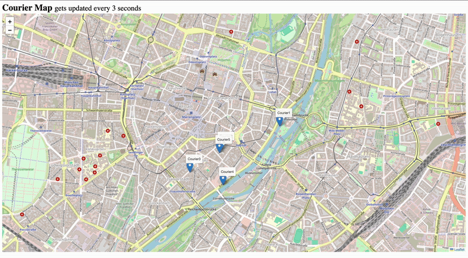

# Courier Tracking App

Using **Redis geospatial** to store randomly generated locations and display them on a **Leaflet map**.

The app tracks couriers, updating their positions every 3 seconds.

## tech stack

- Spring Boot
- Redis
- Thymeleaf + Leaflet map

## run locally

```shell
docker compose up -d
```

## in action

[](./3x-fast.gif)


### redis-cli

        127.0.0.1:6379> GEOPOS couriers Courier1
        1) 1) "11.54907971620559692"
           2) "48.10588609514556424"

        127.0.0.1:6379> GEOPOS couriers Courier2
        1) 1) "11.54877930879592896"
            2) "48.10907223964285606"